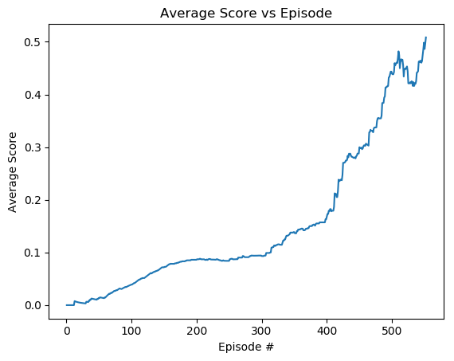

# Tennis with Multi-Agent Deep Deterministic Policy Gradient(MADDPG)
## Introduction

In this environment, two agents control rackets to bounce a ball over a net. If an agent hits the ball over the net, it receives a reward of +0.1. If an agent lets a ball hit the ground or hits the ball out of bounds, it receives a reward of -0.01. Thus, the goal of each agent is to keep the ball in play.

The observation space consists of 8 variables corresponding to the position and velocity of the ball and racket. Each agent receives its own, local observation. Two continuous actions are available, corresponding to movement toward (or away from) the net, and jumping. 

The environment is considered solved, when the average (over 100 episodes) of those scores is at least +0.5. The agents in the gif above was able to score +0.8.

## Getting Started 
**Step 1:**

`git clone https://github.com/zhuohann/MADDPG`

**Step 2:**

Use the package manager [pip](https://pip.pypa.io/en/stable/).
```bash
pip install -r requirements.txt
```

**Step 3:**

Download the Unity environment:
- [Linux](https://s3-us-west-1.amazonaws.com/udacity-drlnd/P3/Tennis/Tennis_Linux.zip)  
- [Mac OSX](https://s3-us-west-1.amazonaws.com/udacity-drlnd/P3/Tennis/Tennis.app.zip)
- [Windows (32-bit)](https://s3-us-west-1.amazonaws.com/udacity-drlnd/P3/Tennis/Tennis_Windows_x86.zip)
- [Windows (64-bit)](https://s3-us-west-1.amazonaws.com/udacity-drlnd/P3/Tennis/Tennis_Windows_x86_64.zip)


## Results
The agents were able to reach an average score of ,over 100 consecutive episodes,0.5 after just 552 episodes.


## Usage

Run [Tennis.ipynb](https://github.com/zhuohann/MADDPG/blob/master/Tennis.ipynb)

## Contributing
Pull requests are welcome. For major changes, please open an issue first to discuss what you would like to change.
## License
[MIT](https://choosealicense.com/licenses/mit/)
